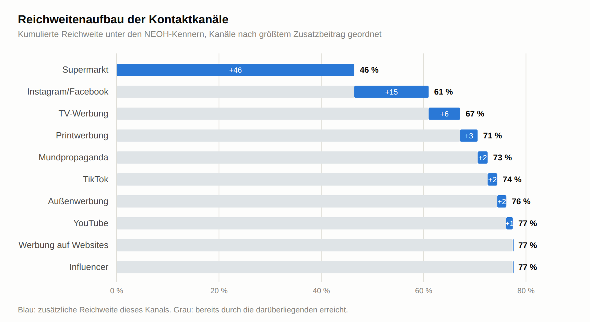
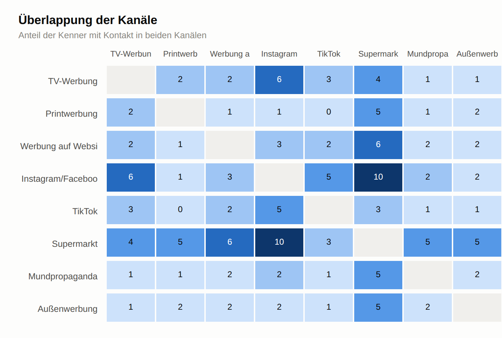
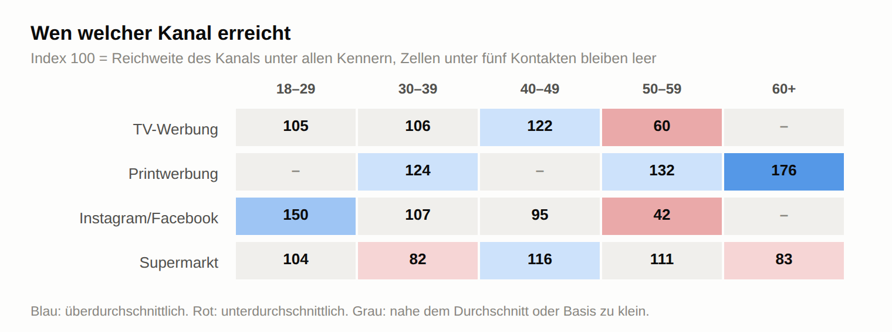

# Kontaktkanäle im Detail — Österreich

Basis: 287 NEOH-Kenner, davon 217 mit mindestens einem Kontakt im letzten
Monat. Reproduzierbar mit `python3 analyse_kanaele_detail_at.py --png`;
vollständige Ausgabe in `ERGEBNISSE_AT_kanaele_detail.txt`, Grafiken in
`grafiken/`.

> Alle Reichweiten gelten **innerhalb der Kenner**, nicht in der Bevölkerung —
> gefragt wurden nur Kenner.

---

## 1. Exklusive Reichweite

Die Frage, die über Streichen oder Behalten entscheidet, ist nicht die
Gesamtreichweite, sondern: Wen erreicht ein Kanal, den sonst keiner erreicht?

| Kanal | gesamt | exklusiv | davon exklusiv |
|---|---:|---:|---:|
| **Supermarkt** | 46,5 % | **25,0 %** | 54 % |
| Instagram/Facebook | 24,4 % | 6,5 % | 27 % |
| TV-Werbung | 14,3 % | 4,0 % | 28 % |
| Printwerbung | 9,2 % | 3,0 % | 33 % |
| Außenwerbung | 7,2 % | 1,8 % | 25 % |
| Mundpropaganda | 7,7 % | 1,6 % | 21 % |
| TikTok | 8,7 % | 1,4 % | 16 % |
| YouTube | 6,8 % | 1,3 % | 19 % |
| **Werbung auf Websites** | 8,1 % | **0,0 %** | 0 % |
| **Influencer** | 4,8 % | **0,0 %** | 0 % |

**Der Supermarkt erreicht ein Viertel aller Kenner exklusiv** — mehr als alle
übrigen neun Kanäle zusammen. Mehr als die Hälfte seiner Reichweite ist
Alleinstellung.

Am anderen Ende: **Werbung auf Websites und Influencer-Empfehlungen erreichen
niemanden, der nicht ohnehin anders erreicht wird.** Ihre Reichweite ist
vollständig gedeckt. Das heißt nicht, daß sie wirkungslos sind — ein zweiter
Kontakt kann verstärken —, aber für den Aufbau von Reichweite tragen sie nach
dieser Messung nichts bei.

---

## 2. Reichweitenaufbau

| Kanal | zusätzlich | kumuliert |
|---|---:|---:|
| Supermarkt | +46,5 Pp. | 46,5 % |
| Instagram/Facebook | +14,5 Pp. | **61,0 %** |
| TV-Werbung | +6,1 Pp. | 67,1 % |
| Printwerbung | +3,4 Pp. | 70,6 % |
| Mundpropaganda | +1,9 Pp. | 72,5 % |
| TikTok | +1,9 Pp. | 74,4 % |
| Außenwerbung | +1,8 Pp. | 76,2 % |
| YouTube | +1,3 Pp. | 77,4 % |
| Werbung auf Websites | +0,0 Pp. | 77,4 % |
| Influencer | +0,0 Pp. | 77,4 % |

**Zwei Kanäle decken 61 % der erreichbaren Kenner ab. Die übrigen acht bringen
zusammen 16 Punkte.**

Der Rest zu 100 % sind die 22,6 %, die im letzten Monat gar keinen Kontakt
hatten — über die abgefragten Kanäle ist diese Gruppe nicht erreichbar
gewesen.

---

## 3. Überlappung

Anteil der Kenner mit Kontakt in **beiden** Kanälen:

| | TV | Print | Websites | Insta/FB | TikTok | Supermarkt |
|---|---:|---:|---:|---:|---:|---:|
| TV-Werbung | — | 2,4 % | 2,4 % | 6,2 % | 2,8 % | 4,0 % |
| Printwerbung | 2,4 % | — | 1,3 % | 1,0 % | 0,0 % | 4,9 % |
| Werbung auf Websites | 2,4 % | 1,3 % | — | 3,5 % | 2,2 % | 6,3 % |
| Instagram/Facebook | 6,2 % | 1,0 % | 3,5 % | — | 4,9 % | **9,9 %** |
| TikTok | 2,8 % | 0,0 % | 2,2 % | 4,9 % | — | 3,3 % |
| Supermarkt | 4,0 % | 4,9 % | 6,3 % | **9,9 %** | 3,3 % | — |

Die stärkste Kombination ist Supermarkt × Instagram/Facebook (9,9 %) — und
genau die, die auch im Reichweitenaufbau zuerst kommt. Print und TikTok
überlappen bei **null Prozent**: zwei vollständig getrennte Publika.

---

## 4. Wen welcher Kanal erreicht

Index 100 = Reichweite des Kanals unter allen Kennern.

| Kanal | 18–29 | 30–39 | 40–49 | 50–59 | 60+ |
|---|---:|---:|---:|---:|---:|
| TV-Werbung | 105 | 106 | 122 | 60 | · |
| Printwerbung | · | 124 | · | 132 | **176** |
| Instagram/Facebook | **150** | 107 | 95 | **42** | · |
| Supermarkt | 104 | 82 | 116 | 111 | 83 |

Nur vier Kanäle sind breit genug besetzt, um einen Index über alle
Altersgruppen zu tragen. Zellen mit weniger als fünf Kontakten sind
ausgelassen — dort wäre jeder Indexwert Scheingenauigkeit. Das betrifft
YouTube, TikTok, Influencer, Mundpropaganda und Außenwerbung über weite
Strecken; in der Textfassung stehen die wenigen belastbaren Werte.

**Der Supermarkt ist der einzige Kanal, der in allen Altersgruppen nahe 100
liegt** (83 bis 116). Alles andere ist segmentiert: Print erreicht die Ältesten
mit Index 176, Instagram/Facebook die Jüngsten mit 150 und die 50- bis
59-Jährigen nur mit 42.

Für die Kanalentscheidung heißt das: Es gibt genau einen Kanal, der alle
erreicht, und er gehört dem Handel.

---

## 5. Kanalkombinationen

| | n | Anteil | erwägen NEOH |
|---|---:|---:|---:|
| nur Handel | 93 | 31,8 % | 33,3 % |
| nur Digital | 53 | 19,8 % | 22,9 % |
| beides | 38 | 14,6 % | 38,1 % |
| weder noch | 103 | 33,7 % | 14,4 % |

Die Erwägungsquoten steigen mit der Zahl der Kontaktarten — **das ist aber
keine Wirkung.** Die Prüfung aus `ERGEBNISSE_AT_kanaele.md` Abschnitt 3 zeigt:
Sobald das Markenurteil kontrolliert ist, trägt die Zahl der Kontaktkanäle
nichts bei (p = 0,342). Wer eine Marke erwägt, nimmt ihre Kontakte
aufmerksamer wahr — die Tabelle misst beides zugleich und kann es nicht
trennen.

---

## 6. Was daraus für die Kanalplanung folgt

1. **Der Handel ist nicht verhandelbar.** Ein Viertel der Kenner wird exklusiv
   über das Regal erreicht, und er ist der einzige Kanal ohne Altersgefälle.
   Jede Distributionslücke ist damit zugleich eine Reichweitenlücke — und das
   verbindet sich direkt mit den Kaufbarrieren aus Stufe 3.
2. **Instagram/Facebook ist der einzige sinnvolle zweite Kanal.** +14,5 Punkte
   zusätzliche Reichweite, stärkste Kombination mit dem Handel, klarer
   Jungfokus.
3. **Websites und Influencer tragen zur Reichweite nichts bei.** Beide Kanäle
   erreichen ausschließlich Menschen, die anders ohnehin erreicht werden.
4. **Für die Über-50-Jährigen bleibt Print und das Regal.** Instagram fällt auf
   Index 42, TikTok auf 19. Wenn die Bekanntheit in dieser Gruppe wachsen soll
   — und dort ist sie am niedrigsten —, führt der Weg über diese beiden.
5. **Ein Drittel der Kenner hatte gar keinen Kontakt.** Diese Gruppe steht in
   allen Kennwerten schlechter da und ist überdurchschnittlich alt. Sie ist der
   eigentliche Adressat, und die abgefragten Kanäle haben sie zuletzt nicht
   erreicht.

**Was diese Daten nicht können:** Wirkung messen. Für eine Aussage darüber,
welcher Kanal Erwägung erzeugt, braucht es eine Wiederholungsmessung mit
Kontaktprotokoll oder ein Experiment. Alles hier ist Reichweite und
Zusammenhang — für die Kanalauswahl ausreichend, für eine Wirkungsbilanz nicht.
